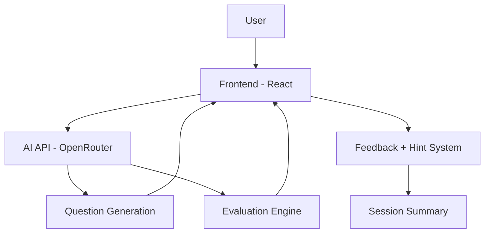
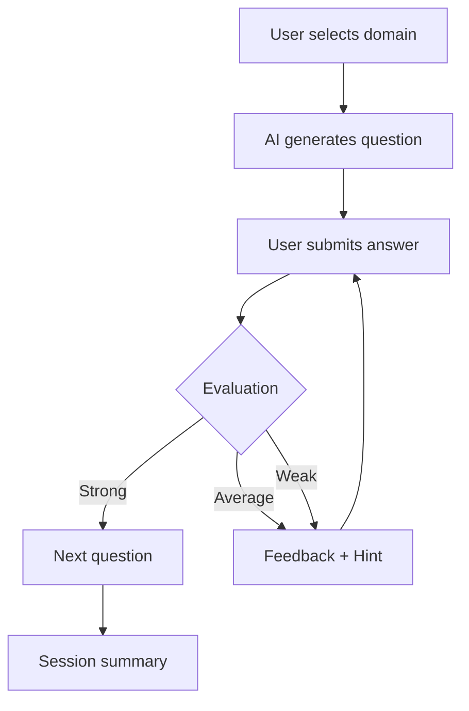
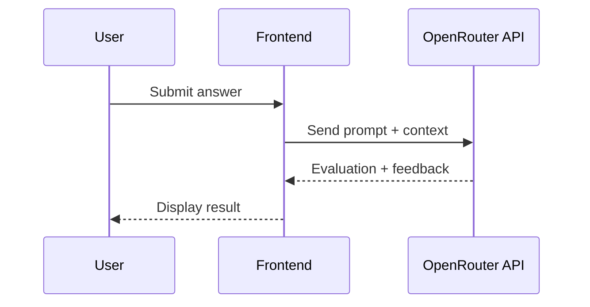
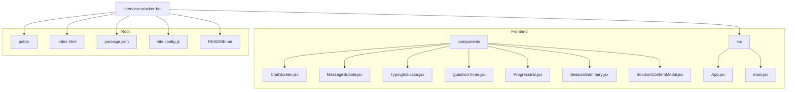

# PrepForge v3.0 — AI Interview Simulator

**Stop Practicing. Start Performing.**

PrepForge is an AI-powered interview simulator that replicates real technical interview pressure.  
It dynamically evaluates responses, adapts questioning strategy, and provides structured feedback to improve reasoning and communication skills.

---

## Overview

PrepForge is not just a chatbot — it behaves like a **strict, real-world interviewer**.

The system generates domain-specific questions, evaluates responses (Strong / Average / Weak), and adapts the interview flow in real time.

The goal is simple:
**Expose weak reasoning, enforce clarity, and build real interview confidence.**

---

## Core Features

- **Dynamic Question Generation**  
  AI generates contextual questions based on selected domain  

- **Adaptive Interview Flow**  
  - Strong → Progress to next question  
  - Average → Follow-up probing  
  - Weak → Guided hints + retry  

- **Live Evaluation System**  
  Real-time grading:
  - Strong  
  - Average  
  - Weak  

- **Instant Feedback Engine**  
  Direct and actionable feedback after each response  

- **Question Timer**  
  Simulates real interview pressure  

- **Hint System**  
  Provides structured guidance without revealing answers  

- **Session Summary**  
  Performance breakdown at the end of interview  

---

## System Architecture



---

## Interview Flow



---

## AI Interaction Flow



---

## Tech Stack

- **Frontend:** React (Vite)  
- **Language:** JavaScript  
- **Styling:** CSS  
- **AI API:** OpenRouter  
- **Deployment:** Vercel  

---

## Project Structure (Visual)



---

## Getting Started

### 1. Clone Repository

```bash
git clone https://github.com/rakeshpedapudi07/interview-cracker-bot.git
cd interview-cracker-bot
```

### 2. Install Dependencies

```bash
npm install
```

### 3. Setup Environment Variables

Create a `.env` file:

```env
VITE_OPENROUTER_KEY=your_api_key_here
```

> ⚠️ Do NOT commit your `.env` file.

### 4. Run the Application

```bash
npm run dev
```

---

## Live Demo

🔗 https://interview-cracker-bot.vercel.app/

---

## Key Highlights

- Real-time adaptive interview simulation  
- AI-driven evaluation and feedback loop  
- Designed for interview pressure simulation  
- Modular frontend architecture  
- Scalable AI interaction design  

---

## Roadmap / Future Improvements

- Backend integration for secure API handling  
- Advanced analytics dashboard  
- Personalized learning recommendations  
- Voice-based interview mode  
- Live coding editor with test cases  

---

## Philosophy

> **Think · Code · Explain · Iterate · Improve**

PrepForge is built on one idea:  
You don’t get better by reading solutions — you get better by struggling through them.

---

## Author

**Rakesh Pedapudi**  
B.Tech (Artificial Intelligence)  
Software Engineering · AI Systems · Full Stack Development  

---

## License

This project is licensed under the **MIT License**.
