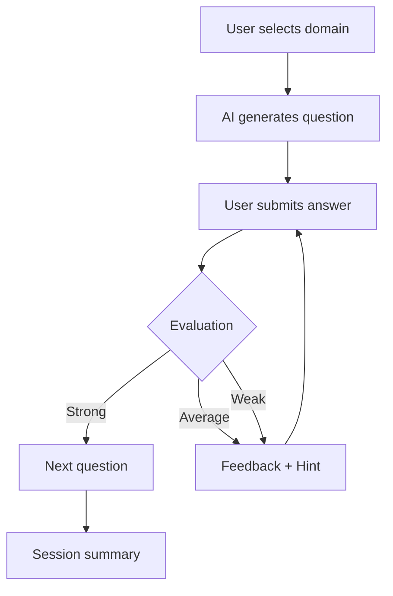

##  PrepForge v3.0 — AI Interview Simulator

**Stop Practicing. Start Performing.**

PrepForge is an AI-powered interview simulator designed to replicate real technical interview pressure. It evaluates your answers, adapts dynamically to your performance, and helps you improve through structured feedback.

---

##  Overview

PrepForge is not just a chatbot — it behaves like a **strict, real-world interviewer**.

It generates domain-specific questions, evaluates responses (Strong / Average / Weak), and adapts the flow based on your performance.

The goal: **Expose weak reasoning, enforce clarity, and build real interview confidence.**

---

## Core Features

-  **Dynamic Question Generation**  
  AI generates questions in real-time based on selected domain.

-  **Adaptive Interview Flow**  
  - Strong → Move forward  
  - Average → Mild probing  
  - Weak → Deep follow-up / hints  

- **Live Evaluation System**  
  Each response is graded:
  - Strong  
  - Average  
  - Weak  

-  **Instant Feedback**  
  Honest, direct feedback after every answer.

-  **Question Timer**  
  Simulates real interview time pressure.

-  **Hint System**  
  Guided nudges without revealing full solutions.

-  **Session Summary**  
  Performance breakdown after completing the interview.

---

##  Supported Domains

- **Data Structures & Algorithms**  
  Arrays, Trees, Graphs, Dynamic Programming, Complexity

- **System Design**  
  Scalability, Databases, Distributed Systems

- **Behavioral / HR**  
  STAR method, Leadership, Communication

---

## How It Works



---

##  Tech Stack

* **Frontend:** React (Vite)
* **Language:** JavaScript
* **Styling:** CSS
* **AI API:** OpenRouter
* **Deployment:** Vercel

---

##  Project Structure

```
interview-cracker-bot/
│
├── public/
│
├── src/
│   ├── components/
│   │   ├── ChatScreen.jsx
│   │   ├── MessageBubble.jsx
│   │   ├── TypingIndicator.jsx
│   │   ├── QuestionTimer.jsx
│   │   ├── ProgressBar.jsx
│   │   ├── SessionSummary.jsx
│   │   └── SolutionConfirmModal.jsx
│   │
│   ├── App.jsx
│   └── main.jsx
│
├── index.html
├── package.json
├── vite.config.js
└── README.md
```

---

##  Getting Started

### 1. Clone the Repository

```bash
git clone https://github.com/rakeshpedapudi07/interview-cracker-bot.git
cd interview-cracker-bot
```

### 2. Install Dependencies

```bash
npm install
```

### 3. Setup Environment Variables

Create a `.env` file in the root directory:

```
VITE_OPENROUTER_KEY=your_api_key_here
```

> ⚠️ Do NOT commit your `.env` file.

### 4. Run the Project

```bash
npm run dev
```

---

## 🌐 Live Demo
```
 https://interview-cracker-bot.vercel.app/
```
---

##  Roadmap / Future Improvements

*  Backend integration for secure API handling
*  Advanced analytics dashboard
*  Personalized learning recommendations
*  Voice-based interview mode
*  Live coding editor with test cases

---

##  Philosophy

> **Think · Code · Explain · Iterate · Improve**

PrepForge is built on one idea:
You don’t get better by reading solutions — you get better by struggling through them.

---

##  Author

**Rakesh Pedapudi**
B.Tech (Artificial Intelligence)
Focused on Software Engineering, AI Systems, and Full Stack Development

---

##  License

This project is licensed under the **MIT License**.

---
